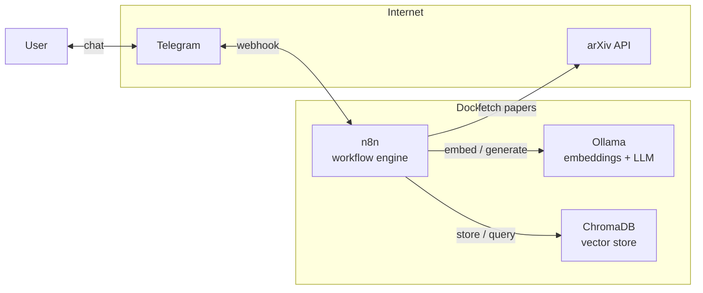
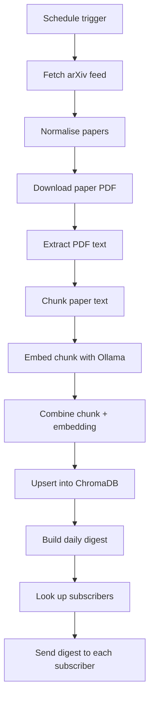
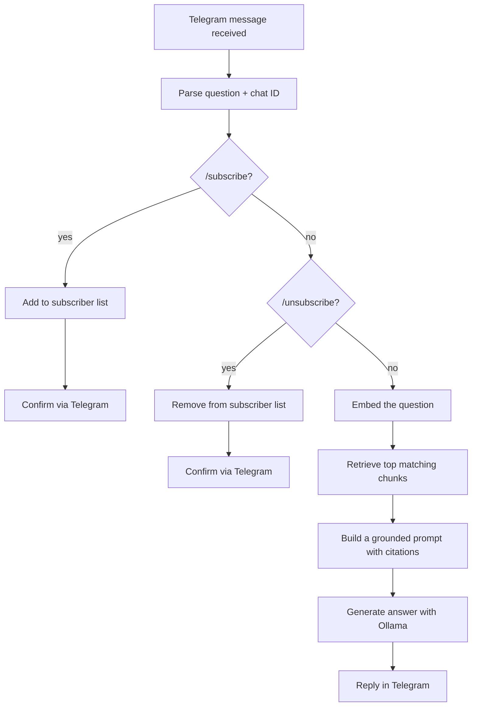

# Research Intelligence

**A self-hosted research assistant that reads arXiv for you and answers questions with citations.**

Research Intelligence watches an arXiv category every day, downloads and indexes the newest papers into a local vector database, and exposes a Telegram bot that anyone can talk to — ask it a question about the papers it has read and it answers grounded in the actual text, with citations back to the source paper. Every morning, subscribers get a digest of what's new. Everything runs on your own machine: the embeddings, the language model, and the vector store are all local, so no paper content or question ever leaves your infrastructure.

<p align="left">
  
  
  
  
  
</p>

---

## Table of contents

- [Why](#why)
- [Features](#features)
- [Architecture](#architecture)
  - [System overview](#system-overview)
  - [Ingestion pipeline](#ingestion-pipeline)
  - [Question-answering pipeline](#question-answering-pipeline)
  - [Data model](#data-model)
- [Tech stack](#tech-stack)
- [Project structure](#project-structure)
- [Getting started](#getting-started)
  - [Prerequisites](#prerequisites)
  - [1. Configure environment](#1-configure-environment)
  - [2. Start the stack](#2-start-the-stack)
  - [3. Create the n8n owner account](#3-create-the-n8n-owner-account)
  - [4. Import the workflows](#4-import-the-workflows)
  - [5. Connect your Telegram bot](#5-connect-your-telegram-bot)
  - [6. Expose the bot to Telegram](#6-expose-the-bot-to-telegram)
  - [7. Activate and run](#7-activate-and-run)
- [Usage](#usage)
- [Verifying the data](#verifying-the-data)
- [Troubleshooting](#troubleshooting)
- [Roadmap](#roadmap)
- [Contributing](#contributing)
- [Acknowledgments](#acknowledgments)

---

## Why

Papers are published faster than anyone can read them. Skimming abstracts across a single active category can already eat hours a week, and actually finding the answer to a specific question buried in a PDF means opening it, searching, and reading through pages of unrelated content. Research Intelligence automates the boring part — fetch, extract, chunk, embed, index — so a real question gets answered directly, backed by the paper it came from, in the place you're already checking anyway: a chat with a bot.

## Features

- **Automated daily ingestion** — pulls the newest papers from arXiv on a schedule, no manual triggering required.
- **Full-text semantic search**, not just abstracts — every paper is chunked and embedded so retrieval can surface the exact paragraph relevant to a question.
- **Grounded, cited answers** — the language model is instructed to answer strictly from retrieved context and cite every claim; when the indexed papers don't cover a question, it says so instead of guessing.
- **A daily digest**, delivered automatically to everyone who's subscribed, summarizing what was indexed that morning.
- **Multi-user by default** — any number of people can message the bot, ask questions, or subscribe/unsubscribe independently; nothing is hardcoded to a single account.
- **Fully local inference** — embeddings and text generation both run through a local Ollama instance. No paper content or user question is sent to a third-party API.
- **No-code orchestration** — the entire pipeline is two n8n workflows, easy to open, inspect, and modify visually.

## Architecture

### System overview

Four services, all containerized, talking to each other over an internal Docker network:



n8n is the only service that talks to the outside world (arXiv and Telegram); Ollama and ChromaDB are purely internal.

### Ingestion pipeline

Runs on a schedule (daily by default). Each run fetches the latest papers, extracts and chunks their full text, embeds every chunk, stores it, and pushes a digest to subscribers:



### Question-answering pipeline

Triggered the moment a message arrives in Telegram. Subscription commands are handled inline; anything else is treated as a question and answered from the indexed corpus:



Both `/subscribe` and `/unsubscribe` work per-user — each Telegram chat ID is tracked independently, so the bot naturally supports any number of simultaneous users without configuration.

### Data model

ChromaDB holds two collections:

| Collection | Purpose | Key fields |
|---|---|---|
| `research_papers` | One entry per text chunk | `id` (`<arXiv ID>-<chunk index>`), embedding vector, chunk text, metadata (`arxivId`, `title`, `published`, `pdfUrl`) |
| `digest_subscribers` | One entry per subscribed chat | `id` (Telegram chat ID) |

## Tech stack

| Layer | Technology |
|---|---|
| Orchestration | [n8n](https://n8n.io) |
| Embeddings + generation | [Ollama](https://ollama.com) (`nomic-embed-text`, `llama3.2`) |
| Vector storage | [ChromaDB](https://www.trychroma.com) |
| Source data | [arXiv API](https://arxiv.org/help/api) |
| Chat interface | [Telegram Bot API](https://core.telegram.org/bots/api) |
| Runtime | Docker Compose |

## Project structure

```text
Research-Intelligence/
├── docker-compose.yml       # n8n, ChromaDB, Ollama, and a one-shot model puller
├── .env.example             # environment variable template
├── requirements.txt         # host-level prerequisites (this project has no app code to pip-install)
└── workflows/
    ├── arxiv-daily-ingestion.json   # ingestion + digest workflow, importable into n8n
    └── telegram-cited-qa.json       # Telegram bot + Q&A workflow, importable into n8n
```

## Getting started

### Prerequisites

- Docker Desktop (or Docker Engine + Compose v2 on Linux)
- A Telegram account, to create a bot
- ~6 GB free disk (container images + the `nomic-embed-text` and `llama3.2` models, pulled automatically on first run)
- 8 GB+ RAM recommended

See [`requirements.txt`](requirements.txt) for the full list.

### 1. Configure environment

```bash
cd Research-Intelligence
cp .env.example .env
```

Set a real `N8N_ENCRYPTION_KEY` in `.env` — any long random string. To generate one:

```bash
python -c "import secrets; print(secrets.token_hex(32))"
```

Leave `WEBHOOK_URL` at its default for now; it's only relevant in [step 6](#6-expose-the-bot-to-telegram).

### 2. Start the stack

```bash
docker compose up -d
```

This brings up four containers: `n8n`, `chroma`, `ollama`, and a one-shot `ollama-init` that runs `ollama pull nomic-embed-text && ollama pull llama3.2`. The models persist in a named volume, so this only downloads once. Confirm everything is healthy:

```bash
docker ps --format "table {{.Names}}\t{{.Status}}"
curl -s http://localhost:5678/healthz          # n8n
curl -s http://localhost:8000/api/v1/heartbeat # ChromaDB
curl -s http://localhost:11434/api/tags        # Ollama — lists the pulled models
```

### 3. Create the n8n owner account

Open `http://localhost:5678` and follow the first-run setup screen. This is a local account — nothing is shared externally.

### 4. Import the workflows

In the n8n UI: **Workflows → Import from File**, and import both:

- `workflows/arxiv-daily-ingestion.json`
- `workflows/telegram-cited-qa.json`

Or, scripted via the n8n CLI inside the container:

```bash
docker cp workflows/arxiv-daily-ingestion.json research-intelligence-n8n:/tmp/
docker cp workflows/telegram-cited-qa.json research-intelligence-n8n:/tmp/
docker exec research-intelligence-n8n n8n import:workflow --input=/tmp/arxiv-daily-ingestion.json
docker exec research-intelligence-n8n n8n import:workflow --input=/tmp/telegram-cited-qa.json
```

### 5. Connect your Telegram bot

1. Message [@BotFather](https://t.me/BotFather) on Telegram, send `/newbot`, and follow the prompts. You'll receive a token that looks like `123456789:AAH...`.
2. In n8n: **Credentials → New → Telegram API**, paste the token, and save.
3. Open both workflows and attach this credential to every Telegram node (`TelegramTrigger`, `Reply subscribed`, `Reply unsubscribed`, `Reply with cited answer`, `Send daily digest`) — they ship with a placeholder credential reference by design, since real credentials should never be committed to source control.

### 6. Expose the bot to Telegram

Telegram delivers messages by calling your bot's webhook over the public internet, so `localhost` needs a public URL in front of it. Any tunnel works — [cloudflared](https://github.com/cloudflare/cloudflared) is a good free option that needs no account:

```bash
# download once
curl -sL -o cloudflared.exe "https://github.com/cloudflare/cloudflared/releases/latest/download/cloudflared-windows-amd64.exe"

# start the tunnel and leave it running
./cloudflared.exe tunnel --url http://localhost:5678
```

It prints a URL like `https://random-words.trycloudflare.com`. Set it in `.env`:

```text
WEBHOOK_URL=https://random-words.trycloudflare.com/
```

Then recreate the n8n container so it picks up the change:

```bash
docker compose up -d n8n
```

If you're deploying this somewhere with a real domain (a VPS, n8n Cloud, etc.), point `WEBHOOK_URL` at that instead and skip the tunnel entirely.

### 7. Activate and run

1. Open `Telegram Cited Q&A` in n8n and toggle it **Active** — this registers the webhook with Telegram.
2. Open `Daily arXiv Ingestion` and click **Execute workflow** once, to populate ChromaDB immediately rather than waiting for the next scheduled run. Embedding a full batch of papers one chunk at a time takes a few minutes — that's expected.
3. Leave `Daily arXiv Ingestion` active too, so ingestion and the digest run automatically every day.

## Usage

Message your bot on Telegram:

```text
You:  /subscribe
Bot:  You're subscribed! You'll receive the daily research digest
      each morning. Send /unsubscribe anytime to stop.

You:  What is class activation mapping?
Bot:  Class Activation Mapping (CAM) is a widely used visual explanation
      technique in Explainable AI. It converts internal model evidence
      into a heatmap that highlights the image regions, channels, or
      tokens supporting a target class [1]...

      Sources:
      [1] Eshghi et al., "Class Activation Mapping in Explainable
          Computer Vision" (arXiv:2608.12299)

You:  /unsubscribe
Bot:  You're unsubscribed from the daily digest.
```

Every morning, subscribers automatically receive something like:

```text
Daily arXiv digest -- 5 paper(s) indexed today

1. DreamFly: Causal Memory and Receding-Horizon Diffusion Planning
   for Aerial Vision-Language Navigation
   arXiv:2608.12308 | https://arxiv.org/pdf/2608.12308
   Aerial vision-language navigation (VLN) requires an embodied agent
   to integrate visual evidence over time...

2. ...
```

## Verifying the data

To confirm ingestion actually populated ChromaDB, without touching the n8n UI:

```bash
# Resolve the research_papers collection and check its size
COLL_ID=$(curl -s -X POST http://localhost:8000/api/v1/collections \
  -H "Content-Type: application/json" \
  -d '{"name":"research_papers","get_or_create":true}' | python -c "import json,sys; print(json.load(sys.stdin)['id'])")
curl -s "http://localhost:8000/api/v1/collections/$COLL_ID/count"

# Inspect a few stored chunks
curl -s -X POST "http://localhost:8000/api/v1/collections/$COLL_ID/get" \
  -H "Content-Type: application/json" \
  -d '{"limit":3,"include":["documents","metadatas"]}'
```

## Troubleshooting

<details>
<summary><strong>docker compose up fails with an encryption key mismatch</strong></summary>

<br>

`.env`'s `N8N_ENCRYPTION_KEY` doesn't match what a previous run already stored in the `n8n_data` volume. Either reuse the original key, or reset for a clean start:

```bash
docker compose down
docker volume rm research-intelligence_n8n_data
docker compose up -d
```

This clears n8n's own state (workflows, credentials, execution history) but not the papers already indexed in ChromaDB (`chroma_data` is a separate volume) or the models Ollama already pulled (`ollama_data`).
</details>

<details>
<summary><strong>The Telegram bot doesn't respond to messages</strong></summary>

<br>

Check `curl https://api.telegram.org/bot<token>/getWebhookInfo` — the `url` field should exactly match your tunnel or public URL, and `last_error_message` should be empty.

A direct test request to that URL returning `403 Provided secret is not valid` is actually a good sign — it confirms the webhook is registered and n8n is correctly rejecting requests that aren't signed by Telegram. A `404` means it isn't registered at all; reactivating the workflow re-registers it.
</details>

<details>
<summary><strong>Ollama requests suddenly take minutes instead of seconds</strong></summary>

<br>

Usually means more requests were queued than Ollama could keep up with. Restart it to clear the backlog — the models stay cached, so nothing needs to be re-downloaded:

```bash
docker restart research-intelligence-ollama
```

</details>

<details>
<summary><strong>A single ChromaDB write fails with "Bad request" among many successful ones</strong></summary>

<br>

This is a rare transient hiccup, not a data problem. The relevant nodes are configured with automatic retries, and the final write step continues past an isolated failure rather than aborting the entire run.
</details>

## Roadmap

- Configurable arXiv categories and page size per deployment, rather than a fixed default
- Optional LLM-narrated digest, as an alternative to the deterministic summary
- Per-subscriber preferences (topics of interest, delivery time, language)
- Faster answer generation via GPU-accelerated or smaller quantized models

## Contributing

Issues and pull requests are welcome. The workflows are plain n8n JSON exports — edit them visually in the n8n UI and re-export, or edit the JSON directly for small, targeted changes.

## Acknowledgments

Built on top of [n8n](https://n8n.io), [Ollama](https://ollama.com), [ChromaDB](https://www.trychroma.com), the [arXiv API](https://arxiv.org/help/api), and the [Telegram Bot API](https://core.telegram.org/bots/api).
