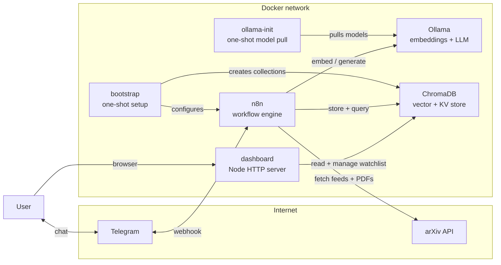
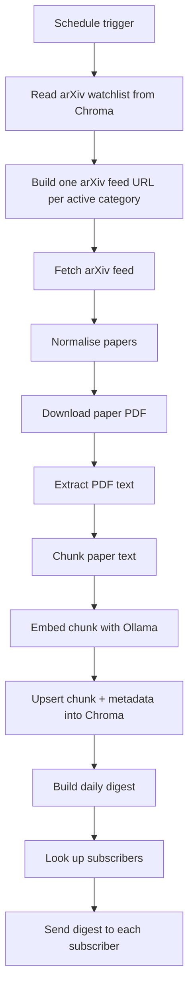
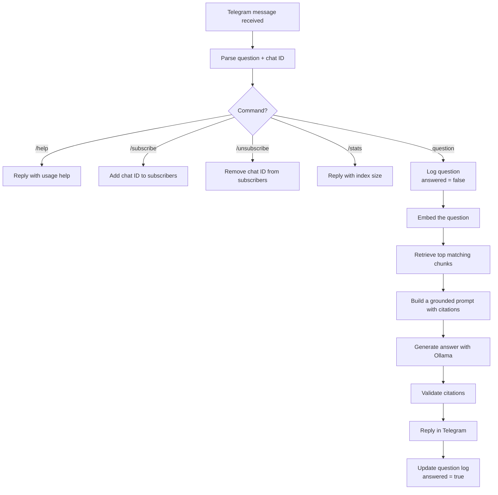

# Research Intelligence

**A self-hosted research assistant that reads arXiv for you and answers questions with citations.**

Research Intelligence watches a configurable list of arXiv categories every day, downloads and indexes the newest papers into a local vector store, and exposes a Telegram bot that anyone can talk to — ask it a question about the papers it has read and it answers grounded in the actual text, with citations back to the source paper. Every morning, subscribers get a digest of what's new. A built-in dashboard shows what's been indexed and lets you manage the watchlist without ever opening n8n. Everything runs on your own machine — the embeddings, the language model, and the vector store are all local, so no paper content or question ever leaves your infrastructure.

<p align="left">
  
  
  
  
  
  
</p>

---

## Table of contents

- [Why](#why)
- [Features](#features)
- [Architecture](#architecture)
  - [System overview](#system-overview)
  - [Ingestion pipeline](#ingestion-pipeline)
  - [Question-answering pipeline](#question-answering-pipeline)
  - [Data model](#data-model)
- [Tech stack](#tech-stack)
- [Project structure](#project-structure)
- [Before you start](#before-you-start)
  - [What you need installed](#what-you-need-installed)
  - [What you'll create](#what-youll-create)
- [Installation](#installation)
  - [Step 1 — Open a terminal in the right folder](#step-1--open-a-terminal-in-the-right-folder)
  - [Step 2 — Run the launcher](#step-2--run-the-launcher)
  - [Step 3 — Fill in the setup page](#step-3--fill-in-the-setup-page)
  - [Step 4 — Let first-boot setup finish](#step-4--let-first-boot-setup-finish)
  - [Installing without the launcher](#installing-without-the-launcher)
- [Using the application](#using-the-application)
  - [The dashboard](#the-dashboard)
  - [Chatting with the bot](#chatting-with-the-bot)
  - [Managing your watchlist](#managing-your-watchlist)
  - [The daily digest](#the-daily-digest)
  - [Triggering an ingestion manually](#triggering-an-ingestion-manually)
  - [Everyday commands](#everyday-commands)
- [Common errors](#common-errors)
- [Design decisions](#design-decisions)
- [Roadmap](#roadmap)
- [Contributing](#contributing)
- [Security notes](#security-notes)
- [Acknowledgments](#acknowledgments)

---

## Why

Papers are published faster than anyone can read them. Skimming abstracts across even one active arXiv category can eat hours a week, and actually answering a specific question buried in a PDF means opening it, searching, and reading through pages of unrelated content. Research Intelligence automates the boring part — fetch, extract, chunk, embed, index — so a real question gets answered directly, backed by the paper it came from, in the place you're already checking anyway: a chat with a bot.

## Features

- **Automated daily ingestion** — pulls the newest papers from every category on your watchlist on a schedule, no manual triggering required.
- **Full-text semantic search**, not just abstracts — every paper is chunked and embedded so retrieval can surface the exact paragraph relevant to a question.
- **Grounded, cited answers with a hallucination guard** — the model is instructed to answer strictly from retrieved context and cite every claim; when the indexed papers don't cover a question, it says so instead of guessing. A deterministic check then strips any citation the model invents anyway, rather than trusting it on prompting alone.
- **A daily digest**, delivered automatically to everyone who's subscribed, summarising what was indexed that morning across every watched category.
- **Multi-user by default** — any number of people can message the bot, ask questions, or subscribe/unsubscribe independently; nothing is hardcoded to a single account.
- **Fully local inference** — embeddings and text generation both run through a local Ollama instance. No paper content or user question is sent to a third-party API.
- **Built-in dashboard** — component health, KPIs, recent papers, watchlist management, subscribers, and a rolling question log in a browser. No opening n8n unless you want to.
- **Guided first-run setup** — a launcher script opens a setup page that walks you through every account you need, with a live **Test** button beside each key that checks it against the real service before saving. No hand-editing config files, no guessing whether a key works.
- **Unattended first boot** — a bootstrap container then provisions the Chroma collections, seeds the arXiv watchlist, creates the n8n account and Telegram credential, and imports and activates both workflows. No manual clicking through n8n.
- **No-code orchestration** — the entire pipeline is two n8n workflows, easy to open, inspect, and modify visually.

## Architecture

### System overview

Five services, all containerised, plus two one-shot init containers:



n8n is the only long-running service that talks to the outside world (arXiv and Telegram). Ollama and ChromaDB are purely internal. The dashboard reads and writes ChromaDB directly so the vector store is a single source of truth for both the workflows and the UI.

### Ingestion pipeline

Runs on a schedule (daily at 08:00 UTC by default). Reads the watchlist from ChromaDB, fetches new arXiv entries for each active category, downloads and chunks the PDFs, embeds every chunk, stores it, and pushes a digest to every subscriber:



An empty or missing watchlist falls back to the `ARXIV_CATEGORIES` value from `.env` so the pipeline never silently produces a no-op.

### Question-answering pipeline

Triggered the moment a message arrives in Telegram. Subscription and help commands are handled inline; anything else is treated as a question, logged for the dashboard, and answered from the indexed corpus:



`/subscribe` and `/unsubscribe` work per-user — each Telegram chat ID is tracked independently, so the bot naturally supports any number of simultaneous users without configuration. Every free-text question is written to a `question_log` collection so the dashboard can show recent activity.

**Validate citations** is a deterministic safety net, not part of the prompt. The model is told twice — once in its system message, once in the user prompt — never to cite a source number outside what was actually retrieved. Live testing showed it does so anyway: asked a question outside the corpus's depth, it cited "(Source 1)" through "(Source 4)" correctly, then also asserted a "Source 36" backed by a fully fabricated Nature paper, complete with a plausible-looking DOI, that was never retrieved. Prompting a small local model isn't sufficient on its own, so this node regex-scans the generated answer, strips any citation or bibliography line outside the valid range, and appends a visible warning if anything was removed — before the reply ever reaches Telegram. See [Design decisions](#design-decisions).

### Data model

ChromaDB holds four collections, all created automatically by the bootstrap container.

**`research_papers`** — the actual knowledge base, one row per text chunk:

| Field | Purpose |
|---|---|
| `id` | `<arXiv ID>-<chunk index>` — deterministic so re-ingesting a paper upserts rather than duplicates |
| `embedding` | Dense vector from `nomic-embed-text` |
| `document` | The chunk text |
| `metadata.arxivId` | arXiv ID |
| `metadata.title` | Paper title |
| `metadata.published` | Publish date from the arXiv feed |
| `metadata.pdfUrl` | Direct link back to the source PDF |
| `metadata.category` | The watchlist category that pulled it |

**`arxiv_categories`** — the watchlist, editable from the dashboard or the API:

| Field | Purpose |
|---|---|
| `id` / `code` | arXiv category code (e.g. `cs.AI`, `stat.ML`) |
| `metadata.maxResults` | Papers to pull for this category on each run |
| `metadata.active` | Uncheck to pause without deleting |
| `metadata.addedAt` | When the row was created |

**`digest_subscribers`** — Telegram chat IDs that opted in to the daily digest:

| Field | Purpose |
|---|---|
| `id` | Telegram chat ID |
| `metadata.chatId` | Same as `id`, kept for convenience |
| `metadata.addedAt` | When they subscribed |

**`question_log`** — rolling log of user questions, used by the dashboard:

| Field | Purpose |
|---|---|
| `id` | `q-<chatId>-<messageId>` |
| `document` | The question text (truncated to 500 chars) |
| `metadata.chatId` | Who asked |
| `metadata.askedAt` | ISO timestamp |
| `metadata.answered` | Set to `true` after the bot replies successfully |

The subscribers, categories, and question-log collections all store a dummy zero embedding — they're used as a key-value store rather than for semantic search — so ChromaDB itself is the single source of truth for every piece of state in the system.

## Tech stack

| Layer | Technology |
|---|---|
| Orchestration | [n8n](https://n8n.io) |
| Source data | [arXiv API](https://arxiv.org/help/api) |
| Embeddings | [Ollama](https://ollama.com) (`nomic-embed-text`) |
| Answer generation | [Ollama](https://ollama.com) (`llama3.2`) |
| Vector + KV storage | [ChromaDB](https://www.trychroma.com) |
| Chat interface | [Telegram Bot API](https://core.telegram.org/bots/api) |
| Dashboard | Node.js standard library (no framework, no build step) |
| Runtime | Docker Compose |

## Project structure

```text
Research-Intelligence-Bot/
├── README.md                 # this file
├── requirements.txt          # host-level prerequisites (nothing to pip install)
├── .gitignore                # keeps .env (real API keys) out of git entirely
└── Research-Intelligence/    # everything runtime lives here
    ├── start.ps1             # one-command launcher (Windows)
    ├── start.sh              # one-command launcher (macOS / Linux)
    ├── docker-compose.yml    # n8n + Chroma + Ollama + dashboard + one-shot bootstrap
    ├── .env.example          # environment variable template
    ├── .env                  # your real keys — created on first run, never committed
    ├── bootstrap/
    │   └── bootstrap.js      # first-boot setup: Chroma collections, n8n account, credential, workflows
    ├── dashboard/
    │   ├── server.js         # HTTP server, Chroma proxy, first-run setup API
    │   └── public/
    │       ├── index.html    # the dashboard
    │       ├── setup.html    # the guided first-run setup page
    │       ├── styles.css
    │       ├── app.js        # dashboard behaviour
    │       └── setup.js      # setup form + live "test this key" checks
    └── workflows/
        ├── arxiv-daily-ingestion.json   # the daily fetch + index + digest pipeline
        └── telegram-cited-qa.json       # the Telegram bot + Q&A pipeline
```

## Before you start

### What you need installed

| Requirement | Notes |
|---|---|
| **Docker Desktop** (Windows/macOS) or **Docker Engine + Compose v2** (Linux) | The only mandatory install. Verify with `docker compose version`. |
| ~6 GB free disk | For the `n8n`, `chromadb/chroma`, `ollama/ollama`, and `node:22-alpine` images, plus the `llama3.2` (~2 GB) and `nomic-embed-text` (~275 MB) models pulled automatically on first boot. |
| 8 GB+ RAM recommended | `llama3.2` runs locally through Ollama. |
| A web browser | For the setup page and dashboard. |

There is nothing to `pip install` and nothing to `npm install` — every component runs inside a container. See [`requirements.txt`](requirements.txt) for the full list.

### What you'll create

You do **not** need to prepare these in advance — the setup page links each one and tests it for you — but here's what's coming:

| Service | What you're getting | Where |
|---|---|---|
| **Telegram bot** | A bot username + a bot token | Message [@BotFather](https://t.me/BotFather) and send `/newbot`. |
| **Public tunnel URL** | An `https://…` URL that forwards to `localhost:5678` so Telegram can reach n8n | The easiest free option is [cloudflared](https://github.com/cloudflare/cloudflared) quick tunnels — no account required. `cloudflared tunnel --url http://localhost:5678` prints a URL and keeps it running. |

If you're deploying to a VPS or n8n Cloud with a real domain, use that as the webhook URL and skip the tunnel entirely.

## Installation

### Step 1 — Open a terminal in the right folder

Everything runs from the inner `Research-Intelligence` folder, not the outer one.

```bash
cd Research-Intelligence
```

Make sure Docker Desktop is actually running first — the whale icon in your system tray/menu bar should be steady, not animating.

### Step 2 — Run the launcher

The launcher is a shell script. Which one you run, and how, depends on your operating system.

#### Windows (PowerShell)

Open **PowerShell** (not Command Prompt), `cd` into the folder, then:

```powershell
.\start.ps1
```

Note the leading `.\` — PowerShell will not run a script from the current folder without it.

**If you get a red error about scripts being disabled on this system**, that's Windows' default execution policy blocking unsigned scripts. It's expected, not a problem with the project. Either run it in a way that bypasses the policy just for this one command:

```powershell
powershell -ExecutionPolicy Bypass -File .\start.ps1
```

…or allow scripts for the current terminal session only (reverts when you close the window):

```powershell
Set-ExecutionPolicy -Scope Process -ExecutionPolicy Bypass
.\start.ps1
```

If you copied the project from another machine or downloaded it, Windows may also mark the file as blocked. Clear that with:

```powershell
Unblock-File .\start.ps1
```

#### macOS / Linux

```bash
chmod +x start.sh    # only needed the first time
./start.sh
```

`chmod +x` marks the file executable. If you'd rather skip that step, `bash start.sh` works too and does the same thing.

#### Windows with Git Bash

If you prefer Git Bash over PowerShell, the `.sh` script works there as well:

```bash
bash start.sh
```

#### What the launcher does

1. Checks Docker is running (and tells you clearly if it isn't).
2. Starts the dashboard container.
3. Opens `http://localhost:8080/setup` in your browser.
4. **Waits** while you fill in the form — leave the terminal open.
5. The moment you save, it brings up the rest of the stack, pulls the Ollama models, runs first-boot setup, prints the logs, and opens the dashboard.

### Step 3 — Fill in the setup page

The page walks through four steps, each linking exactly where to click:

| # | What it asks for | Notes |
|---|---|---|
| 1 | An email and password for n8n | You invent these now. The account is created for you. Password needs 8+ characters, one uppercase, one number. |
| 2 | Telegram bot token | Message [@BotFather](https://t.me/BotFather), run `/newbot`, follow the prompts, paste the token. The **Test** button hits `getMe` and shows you the bot's own username so you know it's the right one. |
| 3 | Public webhook URL | The URL Telegram will call. `cloudflared tunnel --url http://localhost:5678` prints one you can paste in directly. The **Test** button fetches the URL to check it's actually reachable from the internet. |
| 4 | arXiv categories to monitor | Comma-separated codes like `cs.AI, cs.LG, stat.ML`. Full list at [arxiv.org/category_taxonomy](https://arxiv.org/category_taxonomy). The **Test** button asks arXiv itself if the first category returns results, so a typo like `cs.Ai` is caught before saving. |

Use the **Test** button beside each field before saving. It calls the real service and tells you precisely what's wrong — a rejected token, an unreachable tunnel, an unknown category — which is far faster than discovering it later in a failed workflow run.

You never have to invent an `N8N_ENCRYPTION_KEY`; a random one is generated for you.

When you press **Save configuration**, your answers are written to a local `.env` file. Nothing is uploaded anywhere.

### Step 4 — Let first-boot setup finish

The launcher continues automatically. First it waits for the Ollama models to download:

```text
    pulling manifest
    pulling ...    100% ▕██████████████▏ 2.0 GB
    verifying sha256 digest
    writing manifest
    success
```

Then bootstrap runs:

```text
[bootstrap] n8n is up and its REST API is serving.
[bootstrap] ChromaDB is up.
[bootstrap] Created n8n owner account for you@example.com.
[bootstrap] Chroma collection "research_papers" ready.
[bootstrap] Chroma collection "digest_subscribers" ready.
[bootstrap] Chroma collection "arxiv_categories" ready.
[bootstrap] Chroma collection "question_log" ready.
[bootstrap] Seeded arXiv watchlist with: cs.AI, cs.LG.
[bootstrap] Created Telegram credential "Research Intelligence Telegram Bot".
[bootstrap] Imported "Research Intelligence - Daily arXiv Ingestion".
[bootstrap] Activated "Research Intelligence - Daily arXiv Ingestion".
[bootstrap] Imported "Research Intelligence - Telegram Cited Q&A".
[bootstrap] Activated "Research Intelligence - Telegram Cited Q&A".
[bootstrap] Setup complete.
```

Then you're live:

- **Dashboard** — <http://localhost:8080>
- **n8n** — <http://localhost:5678> (log in with the email/password from step 3)

### Installing without the launcher

If you'd rather not use a shell script at all:

```bash
cd Research-Intelligence
cp .env.example .env      # Windows: copy .env.example .env
```

Open `.env` in a text editor and fill in every value — it documents each one inline. Generate an encryption key with:

```bash
python -c "import secrets; print(secrets.token_hex(32))"
```

Then start everything:

```bash
docker compose up -d
docker compose logs -f bootstrap
```

The result is identical; you've just done by hand what the setup page does for you.

## Using the application

### The dashboard

<http://localhost:8080> is where you'll spend your time. It refreshes itself every minute.

- **Component health** — quick pill row showing n8n, ChromaDB, Ollama, and the Telegram credential. Green means reachable and configured; red means the container is down; amber means a token or URL still needs attention.
- **Overview** — papers indexed, chunks embedded, active subscribers, and total questions asked.
- **Recently indexed papers** — newest first, linked to the source PDF.
- **arXiv watchlist** — add, edit, pause, or remove categories. Changes take effect on the next ingestion run.
- **Digest subscribers** — everyone who has sent `/subscribe` to the bot.
- **Recent questions** — a rolling log of what people have asked the bot, with a tick showing which ones got answered.

### Chatting with the bot

Message your bot on Telegram:

```text
You:  /subscribe
Bot:  You're subscribed! You'll receive the daily research digest
      each morning. Send /unsubscribe anytime to stop.

You:  /stats
Bot:  Index status: 4218 chunk(s) currently stored across the indexed
      papers. Ask me anything!

You:  What is class activation mapping?
Bot:  (Source 1) describes Class Activation Mapping (CAM) as a widely used
      visual explanation technique in Explainable AI. It converts internal
      model evidence into a heatmap that highlights the image regions,
      channels, or tokens supporting a target class.

      Sources:
      - Source 1: "Class Activation Mapping in Explainable Computer
        Vision" (arXiv:2608.12299)

You:  /unsubscribe
Bot:  You're unsubscribed from the daily digest.
```

Every command:

| Command | Effect |
|---|---|
| `/help` or `/start` | Show a short usage message |
| `/subscribe` | Add your chat to the daily digest list |
| `/unsubscribe` | Remove your chat from the digest list |
| `/stats` | Reply with how many chunks are indexed right now |
| *anything else* | Treated as a question; the bot embeds it, retrieves matching chunks, and generates a cited answer |

### Managing your watchlist

The watchlist controls what gets fetched. Bootstrap seeds it with whatever you put in `ARXIV_CATEGORIES` during setup so nothing is empty on first run.

- **Add** — fill the form at the bottom of the *arXiv watchlist* panel: category code and how many papers to pull per run. Category codes look like `cs.AI`, `stat.ML`, `math.CO` — see [the full taxonomy](https://arxiv.org/category_taxonomy).
- **Pause** — untick **Active**. The category stays configured but is skipped each run. Better than deleting if you only want to mute it temporarily.
- **Change the pull size** — type a new number directly in the table; it saves as soon as you click away.
- **Remove** — the **Remove** button deletes the row. Papers already indexed for that category stay in the vector store.

If every row on the watchlist is paused or the whole list is empty, the pipeline falls back to `ARXIV_CATEGORIES` from `.env` for that run, so it never becomes a silent no-op.

### The daily digest

Every morning at 08:00 UTC (or whatever you set `INGESTION_CRON` to), the pipeline pulls new papers, indexes them, and sends every subscriber a message like:

```text
Daily arXiv digest -- 8 paper(s) indexed today from cs.AI, cs.LG

1. DreamFly: Causal Memory and Receding-Horizon Diffusion Planning
   for Aerial Vision-Language Navigation
   arXiv:2608.12308 | https://arxiv.org/pdf/2608.12308
   Aerial vision-language navigation (VLN) requires an embodied agent
   to integrate visual evidence over time...

2. ...
```

### Triggering an ingestion manually

You don't need to wait for the schedule — in the n8n UI, open **Research Intelligence - Daily arXiv Ingestion** and click **Execute workflow**. That runs the entire pipeline once, right now. Handy for confirming everything works end to end after the first setup.

### Everyday commands

```bash
cd Research-Intelligence

# see everything that's running and how healthy it is
docker compose ps

# tail the workflow engine
docker compose logs -f n8n

# stop everything (data stays; see below)
docker compose down

# stop and delete all data (workflows, Chroma, Ollama models)
docker compose down --volumes
```

## Common errors

<details>
<summary><strong>docker compose fails with an encryption key mismatch</strong></summary>

<br>

`.env`'s `N8N_ENCRYPTION_KEY` doesn't match what a previous run already stored in the `n8n_data` volume. Either reuse the original key, or reset for a clean start:

```bash
docker compose down
docker volume rm research-intelligence_n8n_data
docker compose up -d
```

This clears n8n's own state (workflows, credentials, execution history) but not the papers already indexed in ChromaDB (`chroma_data` is a separate volume) or the models Ollama already pulled (`ollama_data`).
</details>

<details>
<summary><strong>The Telegram bot doesn't respond to messages</strong></summary>

<br>

Check that:

1. The **Component health** row on the dashboard shows the Telegram credential is configured.
2. `WEBHOOK_URL` in `.env` matches the URL your tunnel is currently on (cloudflared quick tunnels change every restart — pin one if you want a stable URL).
3. `curl https://api.telegram.org/bot<token>/getWebhookInfo` — the `url` field should exactly match your tunnel URL, and `last_error_message` should be empty.

A direct browser request to the webhook URL returning `403 Provided secret is not valid` is actually a good sign — it confirms the webhook is registered and n8n is correctly rejecting requests that aren't signed by Telegram. A `404` means the workflow isn't active; toggle **Research Intelligence - Telegram Cited Q&A** Active in the n8n UI to re-register.
</details>

<details>
<summary><strong>Ollama requests suddenly take minutes instead of seconds</strong></summary>

<br>

Usually means more requests were queued than Ollama could keep up with. Restart it to clear the backlog — the models stay cached, so nothing needs to be re-downloaded:

```bash
docker restart research-intelligence-ollama
```

</details>

<details>
<summary><strong>A single ChromaDB write fails with "Bad request" among many successful ones</strong></summary>

<br>

This is a rare transient hiccup, not a data problem. The relevant nodes are configured with automatic retries, and the final write step continues past an isolated failure rather than aborting the entire run.
</details>

<details>
<summary><strong>The dashboard shows every component as down</strong></summary>

<br>

The stack is probably still starting. Ollama on first boot has to download the `llama3.2` model (~2 GB) before it becomes reachable, which takes several minutes on a normal connection. Watch the launcher output — it shows `docker logs research-intelligence-ollama-init` live. Once that container exits cleanly, everything else is ready within seconds.
</details>

<details>
<summary><strong>The setup page's "Test this URL" for the webhook always fails</strong></summary>

<br>

The test does an actual HTTPS GET to the URL you pasted. Common causes:

- The tunnel process (`cloudflared tunnel --url ...`) is no longer running. Start it in a separate terminal and leave it running.
- The URL doesn't end with a trailing slash. The setup form auto-corrects this on save but the test button uses whatever you typed.
- You pasted an internal URL like `http://localhost:5678/`. That's accepted (the test says so) but Telegram cannot reach it, so the bot will only respond to workflows executed manually.
</details>

<details>
<summary><strong>A reply ends with a "&#9888;&#65039; This answer referenced source number..." warning</strong></summary>

<br>

That's the citation guard working as intended, not a malfunction. Small local models sometimes cite a source number that was never actually retrieved — occasionally backed by a fully invented paper title and DOI that reads as completely real. Every reply is checked before it's sent: an out-of-range citation or fabricated bibliography line is stripped, and this warning tells you it happened rather than silently trusting the model. Treat whatever claim was tied to that number as unverified, and re-ask more specifically if you need a real answer to that part.
</details>

## Design decisions

- **Citations are labelled `(Source n)`, not `[n]`.** About a third of indexed chunks are body text that already contains the source paper's own bracketed reference markers — `[11]`, `[18]`, and so on. Asking the model to cite as `[1]`/`[2]` put the instruction in direct collision with that text, and it started citing numbers that pointed at nothing. `(Source n)` can't collide with a paper's own references.
- **A deterministic citation guard runs after generation, not just a stricter prompt.** The model's system message and user prompt both say, explicitly, never to invent a source label. Live testing showed it does so anyway — asked a question the corpus only partially covered, it correctly cited `(Source 1)`–`(Source 4)`, then also asserted a `(Source 36)` backed by a fully fabricated Nature paper, complete with a plausible DOI, that was never in the retrieved context. A well-worded prompt is not a guarantee with a small local model, so the **Validate citations** node regex-scans the reply for any citation or bibliography line outside the valid range and strips it, appending a visible warning if it found anything — a correctness backstop that doesn't depend on the model behaving.
- **Setup counts as complete by content, not by file existence.** An earlier version treated "does `.env` exist" as "is this instance set up" — which meant a repo shipped with a placeholder `.env`, or a user who copied `.env.example` and stopped there, could never re-open the setup page to actually configure anything. It now checks that the fields that matter (owner credentials, bot token) are present and non-placeholder.
- **The setup page never regenerates an encryption key that already exists.** n8n seals its stored credentials with `N8N_ENCRYPTION_KEY`; silently replacing it on a stack that has already run once would leave n8n unable to decrypt its own Telegram credential. Setup now reuses an existing key if `.env` already has one.
- **Dashboard stats page through the whole collection, not a fixed window.** Reading only the first N records from Chroma undercounted papers whenever an early-indexed paper was chunked into more pieces than a later one — it silently hid the newest papers behind old ones that happened to produce more chunks.
- **Fully local inference.** Ollama runs `llama3.2` and `nomic-embed-text` in-container, so no paper content or user question ever leaves the machine. This project could easily use a hosted API for cheaper/faster generation — the tradeoff is data provenance, which matters for pre-publication research.
- **Chroma as the single source of truth.** The subscribers list, the watchlist, and the question log all live as Chroma collections with dummy zero embeddings. Using one storage layer means the dashboard reads and writes the same records the workflows do — no drift, no sync job.
- **Dependency-free Node.** Both the dashboard and bootstrap use Node's built-in `http`, `fs`, and `fetch` (Node 22) with zero `npm install`. Every container starts in seconds.
- **Idempotent bootstrap.** Re-running `docker compose up -d` after any config change re-runs bootstrap safely: existing collections are `get_or_create`d, existing owners and credentials are skipped, and already-imported workflows are just re-patched to the current credential ID.
- **Bound to `127.0.0.1`.** All exposed ports (5678, 8000, 8080, 11434) bind to the loopback interface only, so nothing on your local network can reach them. Expose them further only if you know why you're doing it.

## Roadmap

- Per-subscriber category filters, so a subscriber to `cs.LG` doesn't get `math.CO` papers in their digest
- Optional LLM-narrated digest, as an alternative to the deterministic summary
- Faster answer generation via GPU-accelerated or smaller quantised models
- Optional auto-provisioned cloudflared tunnel, so the webhook URL never has to be pasted by hand

## Contributing

Issues and pull requests are welcome. The workflows are plain n8n JSON exports — edit them visually in the n8n UI and re-export, or edit the JSON directly for small, targeted changes.

## Security notes

- `.env` holds live credentials (Telegram bot token, n8n owner password). It is `.gitignore`d and must never be committed, even as a "placeholder that gets swapped later".
- The dashboard proxies ChromaDB and holds the Telegram bot token server-side; the browser never sees it.
- Every container port binds to `127.0.0.1` only.
- The setup page can only be filled in once — after `.env` exists, `POST /api/setup` returns HTTP 409 so a passer-by can't overwrite the config.

## Acknowledgments

Built on top of [n8n](https://n8n.io), [Ollama](https://ollama.com), [ChromaDB](https://www.trychroma.com), the [arXiv API](https://arxiv.org/help/api), and the [Telegram Bot API](https://core.telegram.org/bots/api).
